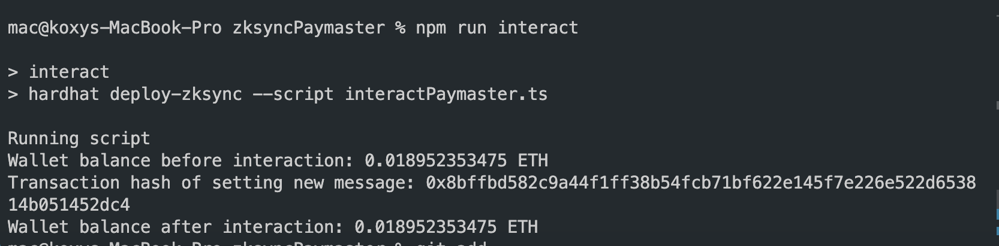
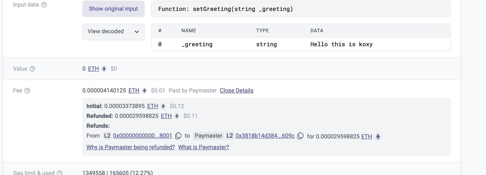

# zkSync Hardhat project

<!-- This project was scaffolded with [zksync-cli](https://github.com/matter-labs/zksync-cli). -->

## Project Layout

- `/contracts`: Contains solidity smart contracts.
- `/deploy`: Scripts for contract deployment and interaction.
- `/test`: Test files.
- `hardhat.config.ts`: Configuration settings.

## How to Use

- `npm run compile`: Compiles contracts.
- `npm run deploy`: Deploys using script `/deploy/deploy.ts`.
- `npm run interact`: Interacts with the deployed contract using `/deploy/interact.ts`.
- `npm run test`: Tests the contracts.

Note: Both `npm run deploy` and `npm run interact` are set in the `package.json`. You can also run your files directly, for example: `npx hardhat deploy-zksync --script deploy.ts`

### Script interaction

### Blockchain explorer

